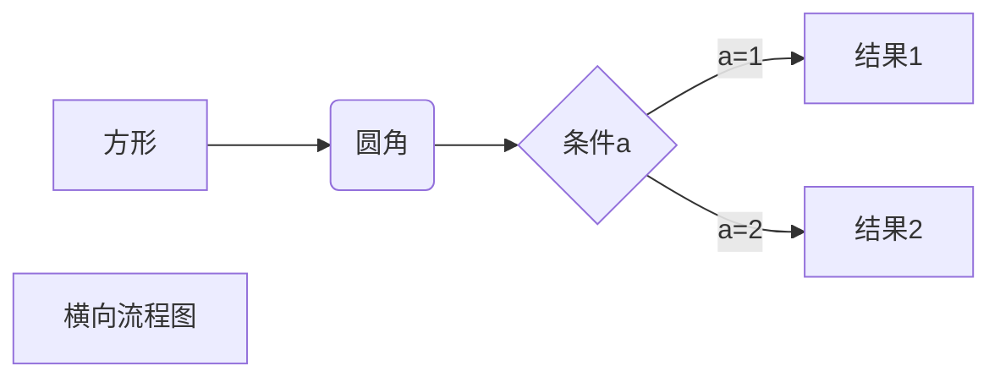
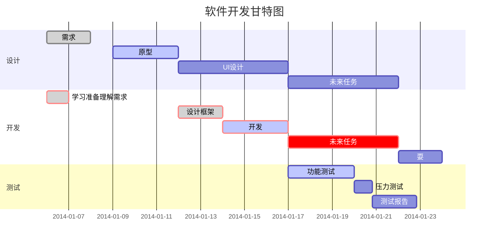

``` bash
ls 查找目录和文件
pwd 当前的位置
cd 目录名 进入目录
touch 文件名 创建文件
mkdir 目录名称  创建目录
vim(vi) 编辑器
vim(vi) 编辑模式 a（下一个字符下） 
vim(vi) 编辑模式 i（当前） 
vim(vi) 编辑模式 o (另起一行做为编辑)
vim(vi) 命令模工 ESC
vim(vi) 保存不退出  :w
vim(vi) 不保存退出  :q
vim(vi) 保存即退出 :x
vim(vi) 上下左右移动  h（左）j(下) k(上) l (右)
vim(vi) 剪切 dd
vim(vi) 复制 yy 
vim(vi) 粘贴 p
vim(vi) ctrl+u 向上翻滚
vim(vi) ctrl+d 向下翻滚
vim(vi) shift + $ 行末
vim(vi) shift + ^ 行首
vim(vi) x 删除当前字符
```


### ls
> 查找目录和文件


我展示的是一级标题
=================

我展示的是二级标题
-----------------


# 一级标题
## 二级标题
### 三级标题
#### 四级标题
##### 五级标题
###### 六级标题


*斜体文本*
**粗体文本**
***粗斜体文本***


***


RUNOOB.COM
GOOGLE.COM
~~BAIDU.COM~~


<u>带下划线文本</u>


创建脚注格式类似这样 [^RUNOOB]。

[^RUNOOB]: 菜鸟教程 -- 学的不仅是技术，更是梦想！！！


* 第一项
* 第二项
* 第三项

+ 第一项
+ 第二项
+ 第三项


- 第一项
- 第二项
- 第三项


1. xxxx
1. yyyy
1. zzzz

1. xxxx
    - xxxxsub
    - xxxxsub2
1. yyyy
    - yyyysub
    - yyyysub2


## title title
> 描述标题

- xxxx
- yyyy


> 最外层
> > 第一层嵌套
> > > 第二层嵌套


> 区块中使用列表
> 1. 第一项
> 2. 第二项
> + 第一项
> + 第二项
> + 第三项


* 第一项
    > 菜鸟教程
    > 学的不仅是技术更是梦想
* 第二项


```javascript
$(document).ready(function () {
    alert('RUNOOB');
});
```


这是一个链接 [菜鸟教程](https://www.runoob.com)

<https://www.runoob.com>


这个链接用 1 作为网址变量 [Google][1]
这个链接用 runoob 作为网址变量 [Runoob][runoob]
然后在文档的结尾为变量赋值（网址）

  [1]: http://www.google.com/
  [runoob]: http://www.runoob.com/


这个链接用 1 作为网址变量 [RUNOOB][1].
然后在文档的结尾为变量赋值（网址）

[1]: http://static.runoob.com/images/runoob-logo.png


|  👎 表头   | 表头  |
|  ----  | ----:  |
| 单元格  | 单元格11111 |
| 单元格  | 单元格 |


$$
\mathbf{V}_1 \times \mathbf{V}_2 =  \begin{vmatrix} 
\mathbf{i} & \mathbf{j} & \mathbf{k} \\
\frac{\partial X}{\partial u} &  \frac{\partial Y}{\partial u} & 0 \\
\frac{\partial X}{\partial v} &  \frac{\partial Y}{\partial v} & 0 \\
\end{vmatrix}
${$tep1}{\style{visibility:hidden}{(x+1)(x+1)}}
$$





